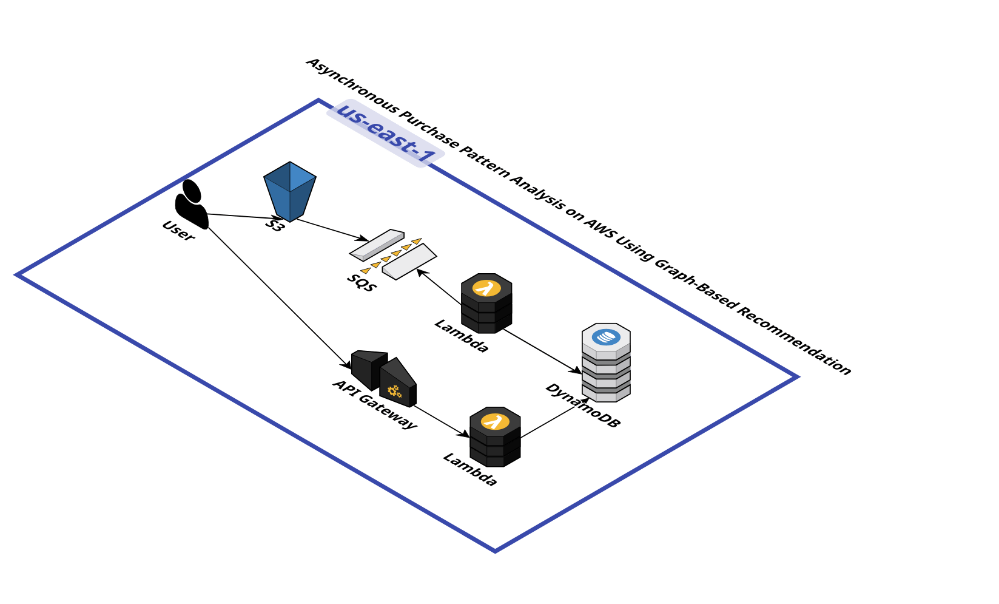

# Lambda Search - Neo4j Graph Query Service

A serverless AWS Lambda function that provides a REST API for searching tickets by product using a **Neo4j graph database** running on **EC2**.

## Architecture



The system follows a hybrid serverless-EC2 architecture pattern:

1. **API Gateway** - Receives HTTP requests with product search queries
2. **Lambda Function** - Processes requests and queries Neo4j
3. **EC2 Instance** - Hosts the Neo4j graph database
4. **Neo4j Database** - Stores ticket data as graph nodes and relationships
5. **Response** - Returns matching tickets in JSON format

> [!IMPORTANT]
> This service uses **Neo4j on EC2**, not DynamoDB. The Lambda function connects to a Neo4j database instance running on an EC2 server.

## Features

- Query tickets by product name using graph database
- Support for both query parameters and request body
- Neo4j Cypher query support for complex graph traversals
- Direct connection to Neo4j on EC2
- CORS enabled for cross-origin requests
- Comprehensive error handling and logging

## Environment Variables

| Variable | Description | Required | Default |
|----------|-------------|----------|---------|
| `NEO4J_URI` | Neo4j connection URI (bolt://EC2_IP:7687) | Yes | None |
| `NEO4J_USER` | Neo4j database username | Yes | `neo4j` |
| `NEO4J_PASSWORD` | Neo4j database password | Yes | None |

## API Usage

### Request Format

**Query Parameter (GET):**
```
GET /search?product=ProductName
```

**Request Body (POST):**
```json
{
  "product": "ProductName"
}
```

### Response Format

**Success (200):**
```json
{
  "product": "ProductName",
  "count": 5,
  "items": [
    {
      "ticketId": "123",
      "product": "ProductName",
      "timestamp": "2025-12-05T10:00:00Z",
      ...
    }
  ]
}
```

**Error (400):**
```json
{
  "message": "Missing required parameter 'product'"
}
```

**Error (500):**
```json
{
  "message": "Internal server error"
}
```

## Deployment

### Prerequisites

- AWS CLI configured with appropriate credentials
- Python 3.x runtime
- EC2 instance running Neo4j database
- Neo4j accessible from Lambda (security groups configured)

### Install Dependencies

```bash
pip install -r requirements.txt -t search/
```

### Deploy to AWS Lambda

1. Create a deployment package:
```bash
cd search
zip -r ../lambda-search.zip .
cd ..
```

2. Create or update the Lambda function:
```bash
aws lambda create-function \
  --function-name lambda-search \
  --runtime python3.11 \
  --role arn:aws:iam::YOUR_ACCOUNT:role/lambda-execution-role \
  --handler lambda_function.lambda_handler \
  --zip-file fileb://lambda-search.zip \
  --environment Variables="{NEO4J_URI=bolt://YOUR_EC2_IP:7687,NEO4J_USER=neo4j,NEO4J_PASSWORD=your_password}"
```

### EC2 Neo4j Setup

**Security Group Configuration:**

- Allow inbound traffic on port **7687** (Bolt protocol) from Lambda
- Allow inbound traffic on port **7474** (HTTP) for Neo4j Browser (optional)

**Neo4j Graph Schema:**

```cypher
// Create a Ticket node
CREATE (t:Ticket {
  ticketId: "123",
  product: "ProductName",
  timestamp: "2025-12-05T10:00:00Z"
})

// Create index on product for faster queries
CREATE INDEX ticket_product IF NOT EXISTS FOR (t:Ticket) ON (t.product)
```

## Performance Considerations

- **Graph Queries:** Neo4j excels at relationship traversals and pattern matching
- **Indexing:** Create indexes on frequently queried properties (e.g., `product`)
- **Connection Pooling:** Lambda maintains connection pool for efficiency
- **VPC Configuration:** Place Lambda and EC2 in same VPC for lower latency

> [!TIP]
> For production use, configure Neo4j with proper indexes and ensure the EC2 instance has adequate resources (memory is critical for Neo4j performance).

## Error Handling

The function includes comprehensive error handling:

- Missing parameters return 400 Bad Request
- Neo4j connection errors are logged and return 500 Internal Server Error
- All errors include descriptive messages for debugging

## Logging

The function uses Python's built-in logging module at INFO level. CloudWatch Logs will contain:

- Incoming event details
- Query parameters
- Neo4j connection status
- Error stack traces (when applicable)

## Development

### Local Testing

```python
# Example event for local testing
event = {
    "queryStringParameters": {
        "product": "TestProduct"
    }
}

# Or with body
event = {
    "body": json.dumps({"product": "TestProduct"})
}

result = lambda_handler(event, None)
print(result)
```

### Neo4j Cypher Query Example

```cypher
// Query used by Lambda to find tickets by product
MATCH (t:Ticket {product: $product})
RETURN t
```

## Architecture Benefits

Using Neo4j on EC2 provides:

- **Graph Capabilities:** Complex relationship queries and pattern matching
- **Flexibility:** Full control over database configuration and resources
- **Scalability:** Can scale EC2 instance vertically as needed
- **Rich Queries:** Cypher query language for powerful graph traversals

## License

This project is provided as-is for educational and commercial use.
